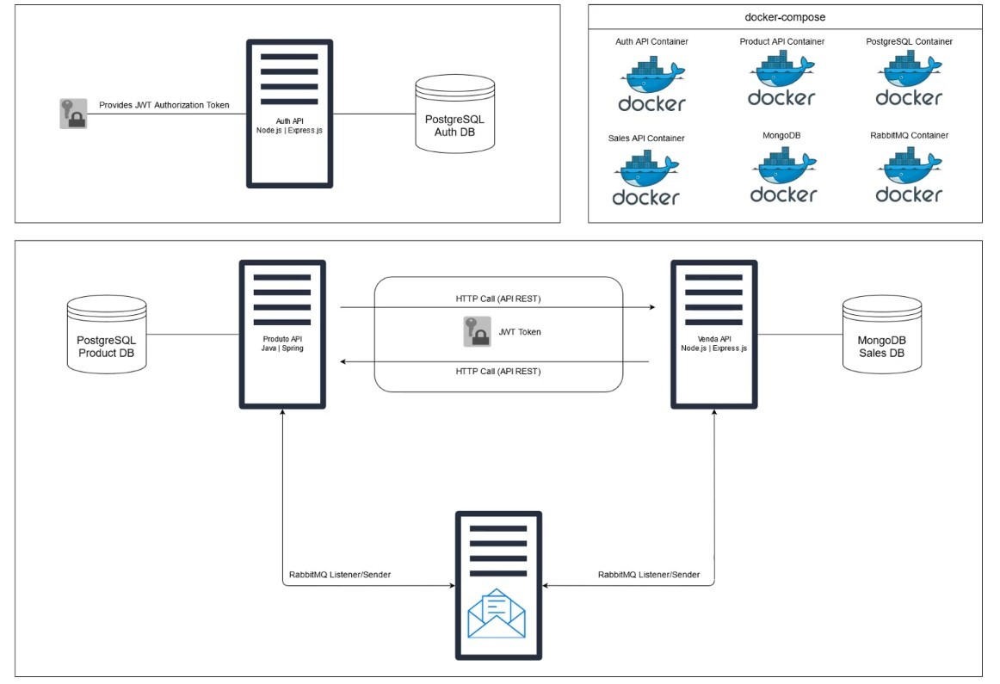

<h2 style="color:#1f6feb">Projeto - Sistema de vendas</h2>

<h3 style="color:#059669">Descrição do Projeto</h3>

Este projeto consiste em um **sistema de vendas** estruturado em múltiplas APIs, seguindo uma arquitetura que combina comunicação síncrona e assíncrona. A aplicação é empacotada em contêineres **Docker**, orquestrada com **Docker Compose** e preparada para ser disponibilizada em produção na plataforma **Heroku**.

<h4 style="color:#d97706">Estrutura do Backend</h4>

O sistema é dividido em três APIs principais:

- **API de Autenticação (Node.js):** Responsável pelo controle de acesso e segurança dos usuários.
- **API de Vendas (Node.js):** Gerencia o registro das vendas, recebendo as requisições de compra feitas pelos clientes.
- **API de Produtos (Spring Boot):** Realiza o gerenciamento do estoque, controlando a quantidade disponível e respondendo às consultas e atualizações dos itens vendidos.

<h4 style="color:#d97706">Comunicação entre Serviços</h4>

A comunicação entre os serviços ocorre de duas formas:

- **Comunicação Síncrona (HTTP/REST):** Utilizada para operações que exigem resposta imediata, como consultar os dados dos produtos no carrinho de compras. A API de vendas faz uma requisição direta à API de produtos, passando os IDs dos itens e recebendo os detalhes necessários para concluir a venda.
- **Comunicação Assíncrona (RabbitMQ):** Utilizada para atualizar o estoque após uma venda concluída. A API de vendas envia uma mensagem para o RabbitMQ, que é consumida posteriormente pela API de produtos para processar a atualização do estoque, sem a necessidade de sincronização imediata entre as aplicações.

Após a atualização do estoque, a API de produtos envia uma resposta para a API de vendas, informando o sucesso ou falha da operação. Com base nesse retorno, o status da venda é atualizado para **CONCLUÍDA** ou **CANCELADA**, garantindo a consistência entre o que foi vendido e o que está disponível no estoque.

<h2 style="color:#1f6feb">Tecnologias e Práticas Utilizadas no Projeto</h2>

- **Comunicação síncrona via REST**
- **Comunicação assíncrona com fila AMQP (RabbitMQ)**
- **Criação de APIs com Java(SpringBoot) e Node.js**
- **Containerização com Docker Compose**
- **Variáveis de ambiente**
- **Deploy na AWS**:
    - Elastic Beanstalk
    - Amazon RDS
    

    <h3 style="color:#059669">Tecnologias Utilizadas</h3>

    - **API REST**
    - **Java v17.0.6 e Spring Boot**
    - **Node.js v24.11.1**
    - **Express.js**
    - **PostgreSQL**
    - **MongoDB**
    - **RabbitMQ**
    - **Docker** e **Docker Compose**
    - **Heroku**

<h2 style="color:#1f6feb">Arquitetura</h2>

